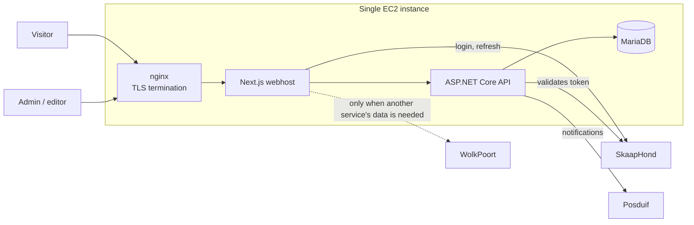
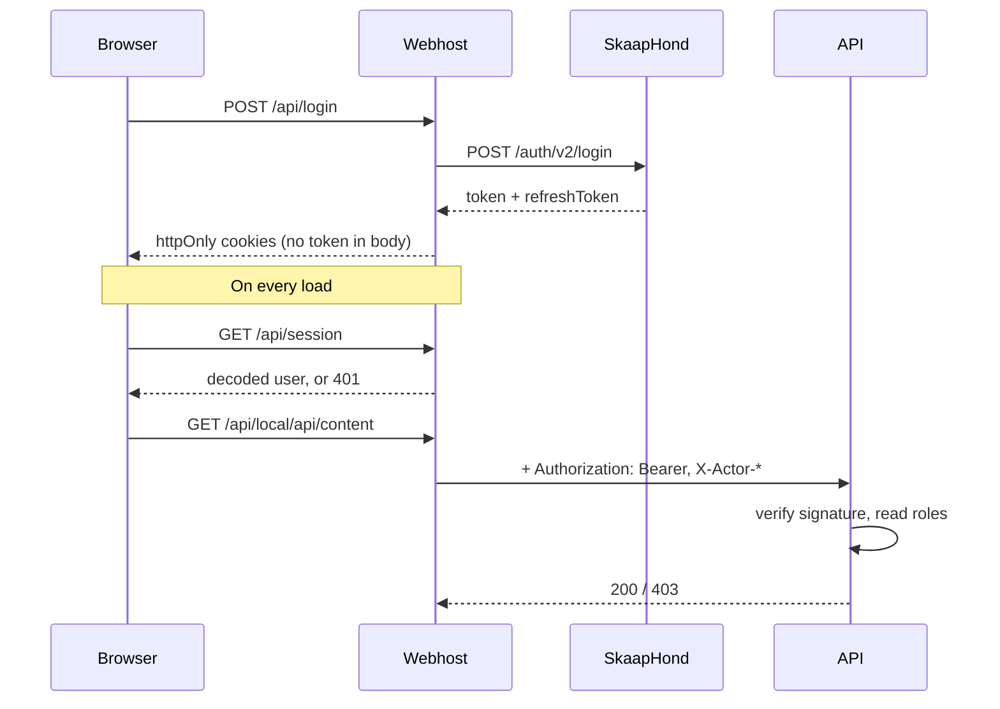
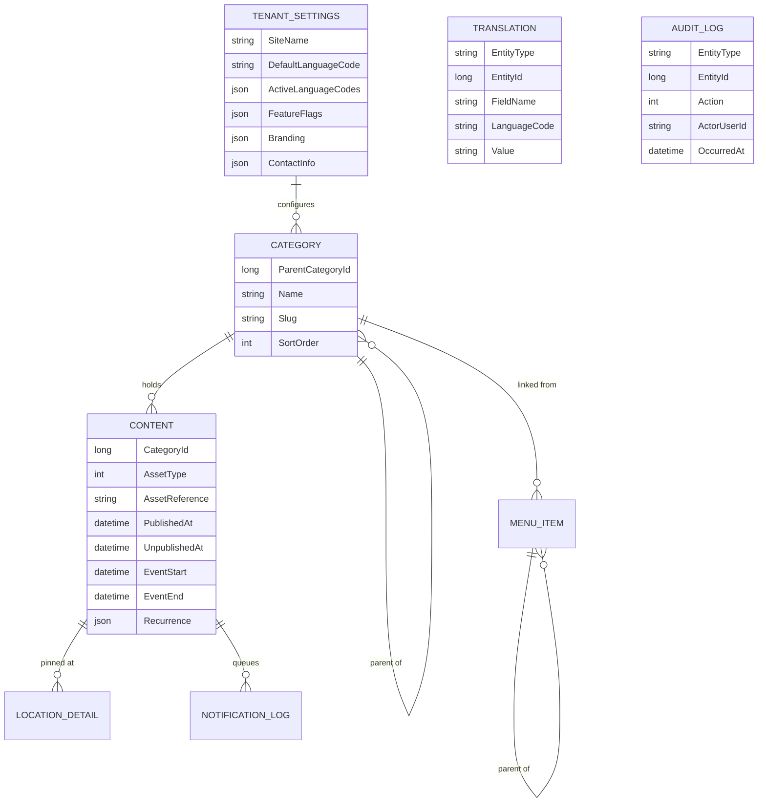

# Architecture

## Where this sits

A lego block is called *through* WolkPoort. This template is not one. It is a
standalone application that calls *out* through WolkPoort when it needs another
service's data.



The database publishes no host port and the API publishes none in production. Both are
reachable only from inside the compose network, so the authenticated surface cannot be
hit directly from the internet.

## Request paths

Three proxies with deliberately different contracts. Confusing them is the most likely
way to break this app.

| Route | Upstream | Auth | Body handling |
|---|---|---|---|
| `/api/local/*` | This deployment's API | Bearer token attached | Plain JSON, untouched |
| `/api/public/*` | This deployment's API | None; GET only | Plain JSON, untouched |
| `/api/backend/*` | WolkPoort | Bearer token attached | Envelope unwrapped, embedded status lifted |

WolkPoort answers `200` even when the inner call failed, and double-encodes its
payload. `/api/backend` unwraps that and lifts the embedded status so callers can
trust `res.ok`. The local API does neither of those things — it returns ordinary
JSON with ordinary status codes, so applying the envelope logic to it would corrupt
every response.

## Authentication



Points that matter:

- **The browser never holds a token.** Cookies are httpOnly, so page script cannot
  read or exfiltrate one. The login response body carries no token either.
- **Tokens above 3500 bytes are split** across numbered cookies and rejoined on read,
  because a single cookie caps near 4KB.
- **Refresh tokens rotate,** so a token is valid once. Concurrent requests share one
  in-flight refresh, and the result stays addressable by the spent token for 30
  seconds — without that, two parallel requests would invalidate each other and sign
  the user out.
- **Authorisation happens in the API**, against the token's signature. The webhost
  decodes the payload without verifying it, but only to decide what to render. The
  `X-Actor-*` headers are audit attribution, not credentials: forging one can
  misattribute an audit row, never grant access.
- **Middleware checks cookie presence only.** It runs without the signing key, and
  exists to send signed-out users to the login page rather than an empty dashboard.

## Data model



`TRANSLATION` and `AUDIT_LOG` attach by `EntityType` + `EntityId` rather than a foreign
key, so any entity becomes translatable or auditable without a schema change.

### Publish window and event window are independent

The single most important rule in this model. `PublishedAt`/`UnpublishedAt` control
whether an item is **visible on the site**. `EventStart`/`EventEnd` describe **when
something happens**. They are validated separately and never against each other.

A concert page published in January for a December event is visible from January. It
stays visible in the following March, because the event being over does not close the
publish window. Conflating the two would silently unpublish every past event.

### Soft deletes

Everything except the audit and notification logs carries `IsDeleted`, and every query
filters on it by default. Deletions are reversible and the audit trail stays
meaningful. Audit rows are append-only and are never soft-deleted.

Categories refuse deletion while they hold children or content, rather than cascading —
removing a section should not silently take its contents with it.

### Translations and fallback

A row stores its text in the deployment's default language. Other languages live in
`TRANSLATION`. A missing translation falls back to the default-language value rather
than hiding the item, so an untranslated field degrades to readable text instead of a
gap. Languages outside the configured list are rejected on write, so translations
cannot accumulate that nothing will ever render.

## Notifications

Publishing content queues a `NOTIFICATION_LOG` row **in the same transaction** as the
change. A background dispatcher drains the queue and sends to Posduif.

This is a transactional outbox, and the reason for it is that a crash between
committing a change and sending its notification would otherwise lose the notification
silently. A failed send is marked `Failed` and left alone — ecosystem convention is to
fail fast rather than retry, and a silent retry loop risks duplicate sends.

## Layering in the API

```
Controllers/    HTTP surface, role attributes, Result -> status mapping
Services/       Orchestration and business rules, returns Result<T>
Repositories/   Data access behind interfaces
Data/           DbContext, configurations, migrations
Domain/         Entities, value objects, enums, constants
```

Following the established GroeiSentrum services (SkaapHond, Kraal, WolkPoort), there
is **no MediatR**. Expected failures return `Result<T>` and are mapped to status codes
at the controller; unexpected failures throw and are caught by the global handler,
which returns a generic Afrikaans message and logs the detail. Exception text can carry
connection strings and SQL, so it never reaches the caller.

All writes in a request share one `IUnitOfWork`, so a mutation, its audit entry and any
queued notification commit together or not at all.

## Language

Code, comments and commits are English. Everything a user sees — labels, errors,
toasts — is Afrikaans, with other languages supplied per tenant through `TRANSLATION`.
